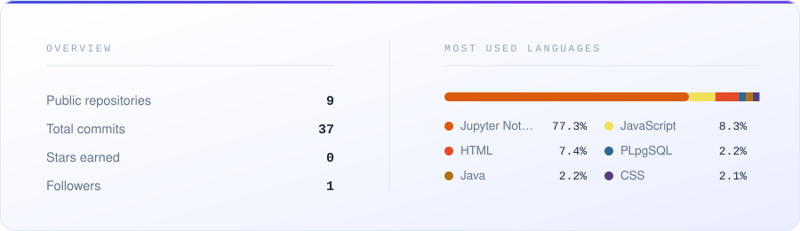

<picture>
  <source media="(prefers-color-scheme: dark)" srcset="./assets/banner-dark.svg">
  <source media="(prefers-color-scheme: light)" srcset="./assets/banner-light.svg">
  
</picture>

 

## About

**AI Engineering student** at Cyprus International University, currently interning at
**ITS Consultant**. I build systems that run themselves — automated workflows that take a
repetitive manual process, wire the right services together, and hand back hours of saved time.

Most of my recent work lives at the intersection of **generative AI, AI agents, and workflow
automation**: n8n orchestrating LLMs, Python services, and APIs into pipelines that validate,
process, decide, and deliver without a human in the loop. Underneath that sits hands-on
experience in machine learning, data analysis, embedded systems, and database design.

- **Focus** — generative AI · AI agents · intelligent automation
- **Building with** — n8n, Python, FastAPI, Google Workspace APIs, Telegram Bot API
- **Foundations** — machine learning, data analysis, database design, embedded systems
- **Learning next** — LLM application development (RAG, tool use, multi-agent workflows), PyTorch, MLOps
- **Open to** — AI/ML internships, automation projects, and open-source collaboration

## Tech Stack

**AI & Automation**

**Languages**

**Machine Learning & Data**

**Databases & Tools**

## Automation & AI Workflows

| Project | What it automates | Stack |
| :--- | :--- | :--- |
| **[CES Report Automation](https://github.com/sufyanqaid2/n8n-ces-report-automation)** | Turns raw Course Evaluation Survey spreadsheets into finished multi-sheet Mail Merge reports — upload, validation, processing, delivery, and logging, with error handling built in. | `n8n` `Python` `FastAPI` `Excel` |
| **[Email Follow-Up Automation](https://github.com/sufyanqaid2/n8n-email-followup-automation)** | Chases unanswered client emails on a schedule, detects replies in Gmail, tracks attempts, updates status in Google Sheets, and stops on its own once a client responds. | `n8n` `Gmail API` `Google Sheets` |
| **[Content Publishing Automation](https://github.com/sufyanqaid2/n8n-content-publishing-automation)** | Takes a raw video from Drive, transcribes and analyses it, generates title, description and hashtags, sends them to Telegram for approval, then publishes to YouTube. | `n8n` `LLM` `Drive` `Telegram` `YouTube` |

## Engineering & Data Projects

| Project | What it does | Stack |
| :--- | :--- | :--- |
| **[Diabetes Prediction](https://github.com/sufyanqaid2/diabetes-prediction)** | End-to-end ML pipeline predicting diabetes from 8 clinical measurements — EDA, model comparison, and interpretation of results. | `Python` `scikit-learn` `pandas` |
| **[Smart Room Automation](https://github.com/sufyanqaid2/smart-room-automation-system)** | IoT system that automates room lighting and climate from motion and temperature sensors, controlled through a mobile dashboard. | `C++` `ESP8266` `Blynk IoT` |
| **[Wildlife Conservation DBMS](https://github.com/sufyanqaid2/wildlife-conservation-dbms)** | Relational database and web dashboard for tracking animals, protected zones, rangers, sightings, and health records. | `PostgreSQL` `JavaScript` `HTML/CSS` |
| **[Car Rental DBMS](https://github.com/sufyanqaid2/car-rental-dbms)** | Full PostgreSQL schema for a rental agency — fleet, customers, staff and contracts — with ERD and analytical queries. | `PostgreSQL` `SQL` |
| **[Podcast Episode Scheduler](https://github.com/sufyanqaid2/podcast-episode-scheduler)** | Object-oriented Java application for planning, scheduling, and tracking podcast episodes. | `Java` `OOP` |

## GitHub Activity

<picture>
  <source media="(prefers-color-scheme: dark)" srcset="./assets/stats-dark.svg">
  
</picture>

  

<picture>
  <source media="(prefers-color-scheme: dark)" srcset="https://raw.githubusercontent.com/sufyanqaid2/sufyanqaid2/output/snake-dark.svg">
  
</picture>

Automating the repetitive, so the interesting work gets the time.

